# Co-Learn - MVP Documentation

## Table of Contents
1. [Requirements Document](#requirements-document)
2. [System Architecture Diagrams](#system-architecture-diagrams)
3. [System Components](#system-components)
4. [System Requirements](#system-requirements)
5. [Sequence Diagrams](#sequence-diagrams)
6. [Data Flow Diagram](#data-flow-diagram)
7. [AI System Architecture](#ai-system-architecture)
8. [API Documentation](#api-documentation)
9. [Additional Diagrams](#additional-diagrams)

---

# Requirements Document

## 1. Project Overview

### 1.1 Purpose
The Egypt LMS Platform is a production-grade learning management system designed specifically for Egyptian high school students (Thanaweya Amma), combining Google Classroom functionality with advanced AI-powered grading and personalized feedback systems.

### 1.2 Scope
This MVP includes:
- Complete classroom management system
- AI-powered grading with personalized feedback
- Real-time communication features
- Comprehensive analytics dashboard

### 1.3 Stakeholders
- **Students**: High school students in Egypt
- **Teachers**: Educators managing courses and grading
- **Parents**: Monitoring student progress
- **Administrators**: System management and oversight

## 2. Functional Requirements

### 2.1 Authentication & Authorization
- **FR-AUTH-001**: System shall support user registration with email verification
- **FR-AUTH-002**: System shall implement JWT-based authentication
- **FR-AUTH-003**: System shall support role-based access control (Student, Teacher, Admin)
- **FR-AUTH-004**: System shall provide password reset functionality
- **FR-AUTH-005**: System shall support refresh token mechanism

### 2.2 Course Management
- **FR-COURSE-001**: Teachers shall create, update, and archive courses
- **FR-COURSE-002**: Students shall join courses via invitation code
- **FR-COURSE-003**: System shall display courses in card/list view
- **FR-COURSE-004**: System shall support course member management

### 2.3 Assignments & Submissions
- **FR-ASSIGN-001**: Teachers shall create assignments with due dates
- **FR-ASSIGN-002**: Students shall submit assignments (PDF/images)
- **FR-ASSIGN-003**: System shall support file attachments up to 50MB
- **FR-ASSIGN-004**: System shall track submission status

### 2.4 Materials & Resources
- **FR-MAT-001**: Teachers shall upload course materials
- **FR-MAT-002**: System shall organize materials in folders
- **FR-MAT-003**: System shall support various file formats
- **FR-MAT-004**: Materials shall be downloadable by enrolled students

### 2.5 Announcements
- **FR-ANN-001**: Teachers shall post announcements to courses
- **FR-ANN-002**: Students shall comment on announcements
- **FR-ANN-003**: System shall support rich text formatting
- **FR-ANN-004**: Announcements shall trigger notifications

### 2.6 AI Grading System
- **FR-AI-001**: System shall process PDF and image submissions
- **FR-AI-002**: AI shall grade assignments within 30 seconds
- **FR-AI-003**: System shall provide personalized feedback
- **FR-AI-004**: System shall identify common mistake patterns
- **FR-AI-005**: System shall generate actionable improvement suggestions

### 2.7 Notifications
- **FR-NOTIF-001**: System shall send email notifications
- **FR-NOTIF-002**: System shall provide in-app notifications
- **FR-NOTIF-003**: Users shall configure notification preferences
- **FR-NOTIF-004**: System shall support real-time notifications

### 2.8 Calendar Integration
- **FR-CAL-001**: System shall display assignment due dates
- **FR-CAL-002**: System shall integrate with Google Calendar
- **FR-CAL-003**: System shall provide month/week/day views
- **FR-CAL-004**: System shall export calendar events

### 2.9 Messaging
- **FR-MSG-001**: Users shall send direct messages
- **FR-MSG-002**: System shall support group chats for courses
- **FR-MSG-003**: Messages shall support file attachments
- **FR-MSG-004**: System shall show typing indicators

### 2.10 Analytics & Insights
- **FR-ANALYTICS-001**: System shall show class-wide performance metrics
- **FR-ANALYTICS-002**: System shall identify struggle patterns
- **FR-ANALYTICS-003**: Teachers shall view individual student progress
- **FR-ANALYTICS-004**: System shall generate exportable reports

## 3. Non-Functional Requirements

### 3.1 Performance
- **NFR-PERF-001**: Page load time shall be < 2 seconds
- **NFR-PERF-002**: API response time shall be < 500ms
- **NFR-PERF-003**: AI grading shall complete within 30 seconds
- **NFR-PERF-004**: System shall support 10,000 concurrent users

### 3.2 Security
- **NFR-SEC-001**: All data transmission shall use HTTPS
- **NFR-SEC-002**: Passwords shall be bcrypt hashed
- **NFR-SEC-003**: System shall implement rate limiting
- **NFR-SEC-004**: File uploads shall be virus scanned

### 3.3 Usability
- **NFR-USE-001**: Interface shall be responsive (mobile-friendly)
- **NFR-USE-002**: System shall support Arabic and English
- **NFR-USE-003**: UI shall be accessible (WCAG 2.1 AA)
- **NFR-USE-004**: System shall provide contextual help

### 3.4 Reliability
- **NFR-REL-001**: System uptime shall be 99.9%
- **NFR-REL-002**: System shall auto-save user work
- **NFR-REL-003**: System shall handle failures gracefully
- **NFR-REL-004**: Data shall be backed up daily

### 3.5 Scalability
- **NFR-SCALE-001**: System shall scale horizontally
- **NFR-SCALE-002**: Database shall support sharding
- **NFR-SCALE-003**: Static assets shall use CDN
- **NFR-SCALE-004**: System shall use caching effectively

---

# System Architecture Diagrams

## Level 1: Simplified Architecture

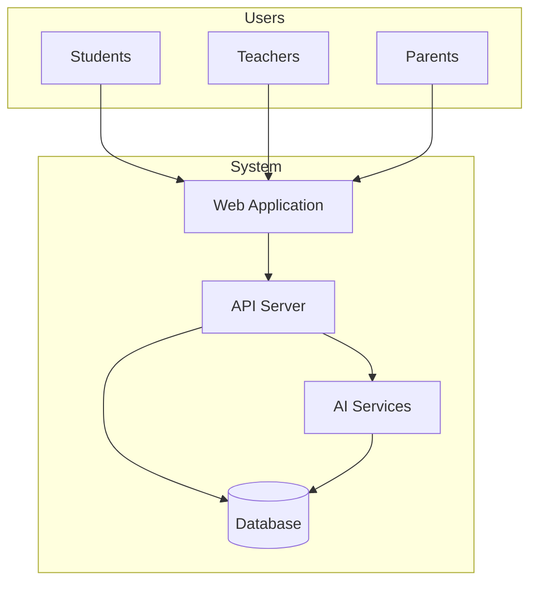

## Level 2: Medium Detail Architecture

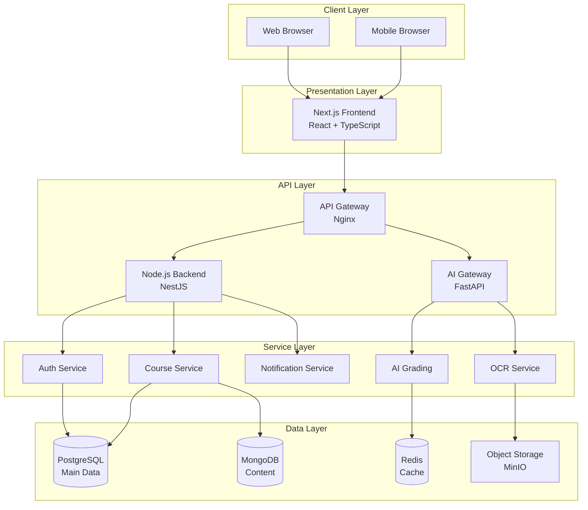

## Level 3: Detailed Architecture

```mermaid
graph TB
    subgraph "Client Layer"
        Web[Web Browser<br/>Chrome/Safari/Firefox]
        Mobile[Mobile Browser<br/>Responsive PWA]
        API_Client[API Clients<br/>Postman/Scripts]
    end
    
    subgraph "CDN & Static Assets"
        CloudFlare[CloudFlare CDN]
        Static[Static Files<br/>Images/CSS/JS]
    end
    
    subgraph "Load Balancer"
        Nginx[Nginx<br/>Reverse Proxy<br/>SSL Termination]
    end
    
    subgraph "Frontend Application"
        NextJS[Next.js 14<br/>App Router]
        React[React Components<br/>TypeScript]
        Zustand[State Management<br/>Zustand]
        TailwindCSS[Styling<br/>TailwindCSS]
        SocketClient[Socket.io Client<br/>Real-time]
    end
    
    subgraph "Backend Services"
        subgraph "Node.js Backend"
            NestJS[NestJS Framework]
            AuthModule[Auth Module<br/>JWT/Passport]
            CourseModule[Course Module]
            AssignModule[Assignment Module]
            NotifyModule[Notification Module]
            MessageModule[Messaging Module]
            CalendarModule[Calendar Module]
        end
        
        subgraph "Python AI Services"
            AIGateway[AI Gateway<br/>FastAPI]
            OCRService[OCR Service<br/>Tesseract/EasyOCR]
            GradingService[Grading Service<br/>OpenAI/Claude]
            FeedbackService[Feedback Service<br/>LangChain]
            InsightsService[Insights Service<br/>Analytics]
        end
    end
    
    subgraph "Message Queue"
        RabbitMQ[RabbitMQ]
        BullQueue[Bull Queue<br/>Redis-based]
    end
    
    subgraph "Databases"
        subgraph "Primary Storage"
            Postgres[(PostgreSQL<br/>Users/Courses/Grades)]
            MongoDB[(MongoDB<br/>Materials/Content)]
        end
        
        subgraph "Cache & Session"
            Redis[(Redis<br/>Cache/Sessions)]
        end
        
        subgraph "Object Storage"
            MinIO[MinIO/S3<br/>Files/Uploads]
        end
        
        subgraph "Vector Storage"
            ChromaDB[(ChromaDB<br/>Embeddings)]
        end
    end
    
    subgraph "External Services"
        Gmail[Gmail API<br/>Email]
        GoogleCal[Google Calendar API]
        OpenAI[OpenAI API<br/>GPT-4]
        Anthropic[Anthropic API<br/>Claude]
    end
    
    subgraph "Monitoring & Logging"
        Prometheus[Prometheus<br/>Metrics]
        Grafana[Grafana<br/>Dashboards]
        Sentry[Sentry<br/>Error Tracking]
        ELK[ELK Stack<br/>Logs]
    end
    
    Web --> CloudFlare
    Mobile --> CloudFlare
    CloudFlare --> Static
    CloudFlare --> Nginx
    API_Client --> Nginx
    
    Nginx --> NextJS
    Nginx --> NestJS
    Nginx --> AIGateway
    
    NextJS --> React
    React --> Zustand
    React --> TailwindCSS
    NextJS --> SocketClient
    
    NestJS --> AuthModule
    NestJS --> CourseModule
    NestJS --> AssignModule
    NestJS --> NotifyModule
    NestJS --> MessageModule
    NestJS --> CalendarModule
    
    AIGateway --> OCRService
    AIGateway --> GradingService
    AIGateway --> FeedbackService
    AIGateway --> InsightsService
    
    AuthModule --> Postgres
    CourseModule --> Postgres
    AssignModule --> MongoDB
    NotifyModule --> RabbitMQ
    MessageModule --> Redis
    
    OCRService --> MinIO
    GradingService --> ChromaDB
    FeedbackService --> OpenAI
    InsightsService --> Postgres
    
    NotifyModule --> Gmail
    CalendarModule --> GoogleCal
    GradingService --> Anthropic
    
    NestJS --> Prometheus
    AIGateway --> Prometheus
    Prometheus --> Grafana
    NestJS --> Sentry
    NestJS --> ELK
```

---

# System Components

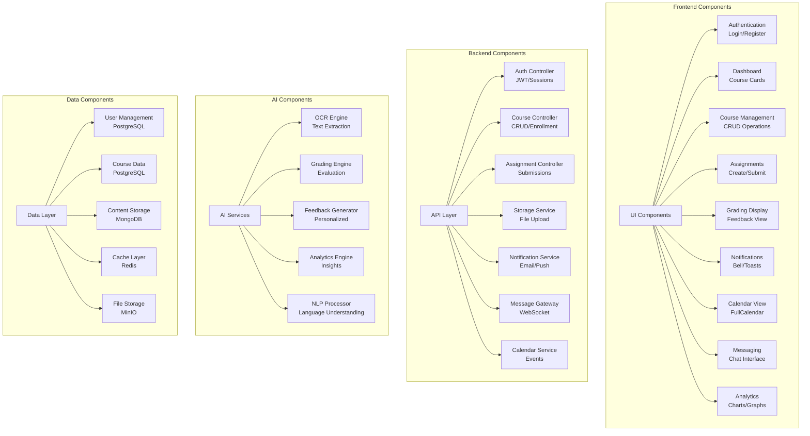

---

# System Requirements

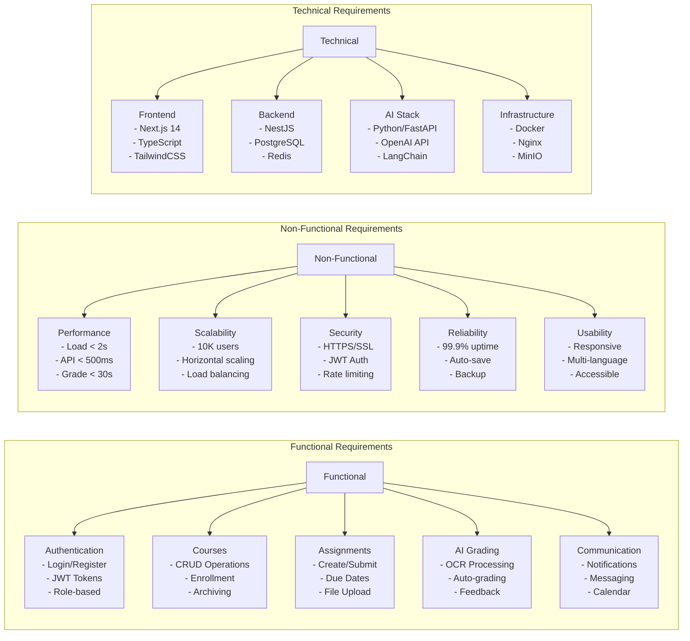

---

# Sequence Diagrams

## Main System Flow

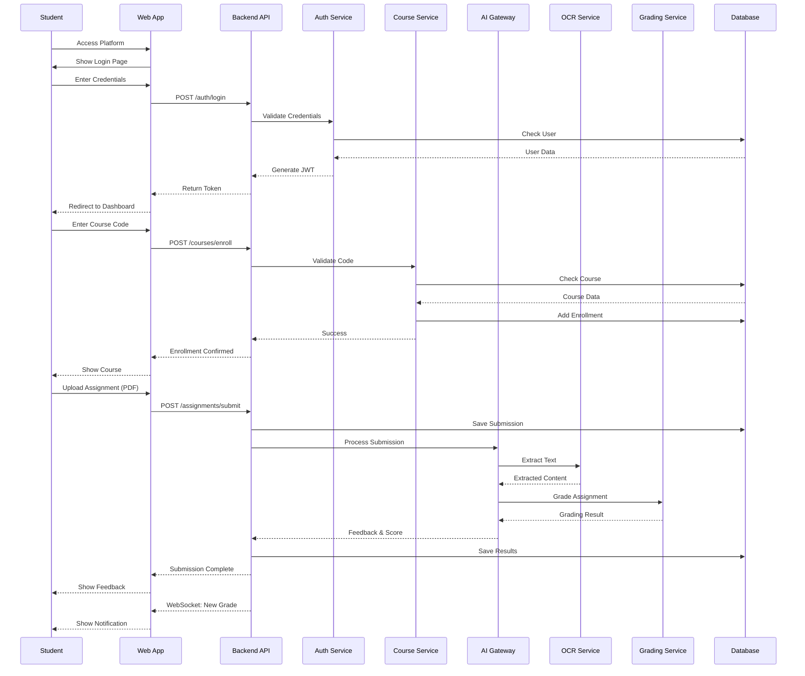

## AI Grading Detailed Flow

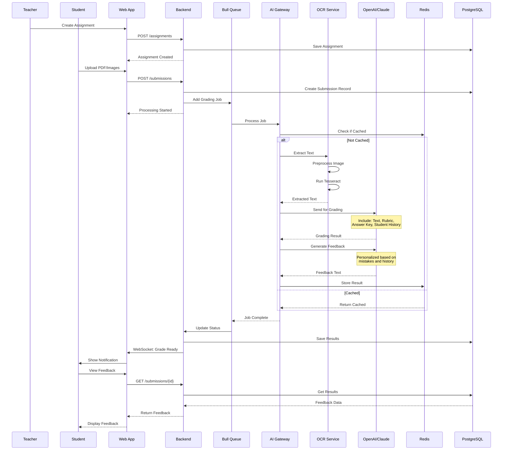

---

# Data Flow Diagram

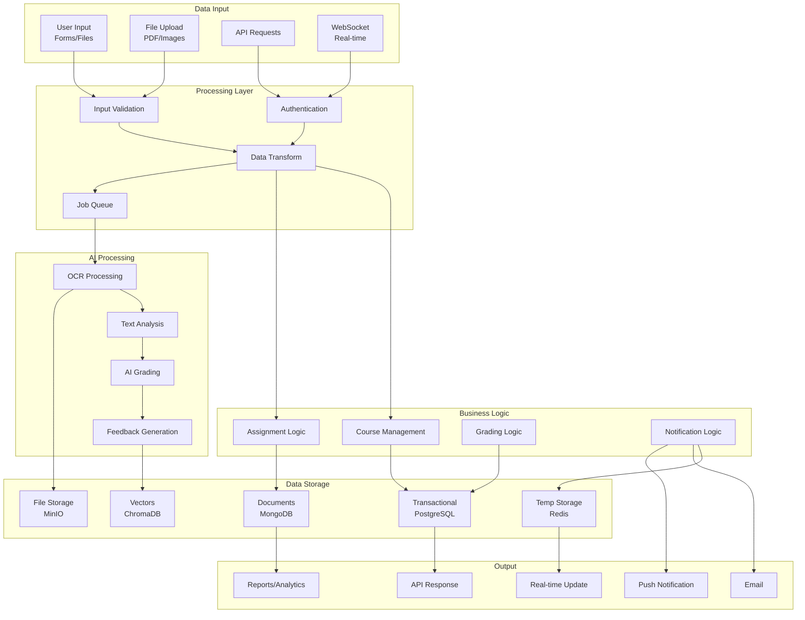

---

# AI System Architecture

```mermaid
graph TB
    subgraph "Input Layer"
        PDF[PDF Files]
        IMG[Images<br/>JPG/PNG]
        TEXT[Text Input]
        RUBRIC[Grading Rubric]
    end
    
    subgraph "OCR Service"
        PreProcess[Image Preprocessing<br/>Rotation/Enhancement]
        Tesseract[Tesseract OCR<br/>Multi-language]
        EasyOCR[EasyOCR<br/>Handwriting]
        PDFExtract[PDF Text Extraction<br/>PyPDF2]
        TextClean[Text Cleaning<br/>Arabic/English]
    end
    
    subgraph "AI Gateway"
        Router[Request Router]
        Validator[Input Validator]
        RateLimiter[Rate Limiter]
        CircuitBreaker[Circuit Breaker]
    end
    
    subgraph "Grading Engine"
        subgraph "Analysis"
            ContentAnalyzer[Content Analyzer]
            RubricMatcher[Rubric Matcher]
            AnswerComparer[Answer Comparison]
            MistakeDetector[Mistake Detection]
        end
        
        subgraph "LLM Processing"
            PromptBuilder[Prompt Builder]
            OpenAIAPI[OpenAI GPT-4]
            ClaudeAPI[Claude API]
            ResponseParser[Response Parser]
        end
        
        subgraph "Scoring"
            ScoreCalculator[Score Calculator]
            PartialCredit[Partial Credit]
            WeightedScoring[Weighted Scoring]
        end
    end
    
    subgraph "Feedback Generator"
        PersonalizedFeedback[Personalized Feedback]
        MistakeExplanation[Mistake Explanations]
        ImprovementTips[Improvement Tips]
        ResourceSuggestions[Resource Suggestions]
        ProgressTracking[Progress Tracking]
    end
    
    subgraph "Analytics Engine"
        PatternAnalyzer[Pattern Analyzer]
        ClassInsights[Class Insights]
        StruggleIdentifier[Struggle Areas]
        TrendAnalysis[Trend Analysis]
        ReportGenerator[Report Generator]
    end
    
    subgraph "Storage"
        ResultCache[Redis Cache<br/>Results]
        HistoryDB[PostgreSQL<br/>History]
        EmbeddingDB[ChromaDB<br/>Embeddings]
    end
    
    PDF --> PreProcess
    IMG --> PreProcess
    PreProcess --> Tesseract
    PreProcess --> EasyOCR
    PDF --> PDFExtract
    
    Tesseract --> TextClean
    EasyOCR --> TextClean
    PDFExtract --> TextClean
    
    TextClean --> Router
    TEXT --> Router
    RUBRIC --> Router
    
    Router --> Validator
    Validator --> RateLimiter
    RateLimiter --> CircuitBreaker
    
    CircuitBreaker --> ContentAnalyzer
    ContentAnalyzer --> RubricMatcher
    RubricMatcher --> AnswerComparer
    AnswerComparer --> MistakeDetector
    
    MistakeDetector --> PromptBuilder
    PromptBuilder --> OpenAIAPI
    PromptBuilder --> ClaudeAPI
    OpenAIAPI --> ResponseParser
    ClaudeAPI --> ResponseParser
    
    ResponseParser --> ScoreCalculator
    ScoreCalculator --> PartialCredit
    PartialCredit --> WeightedScoring
    
    WeightedScoring --> PersonalizedFeedback
    MistakeDetector --> MistakeExplanation
    PersonalizedFeedback --> ImprovementTips
    ImprovementTips --> ResourceSuggestions
    ResourceSuggestions --> ProgressTracking
    
    ProgressTracking --> PatternAnalyzer
    PatternAnalyzer --> ClassInsights
    ClassInsights --> StruggleIdentifier
    StruggleIdentifier --> TrendAnalysis
    TrendAnalysis --> ReportGenerator
    
    PersonalizedFeedback --> ResultCache
    ProgressTracking --> HistoryDB
    ContentAnalyzer --> EmbeddingDB
```

---

# API Documentation

## API Endpoints Detail

### Authentication Endpoints

| Method | Endpoint | Description | Request Body | Response |
|--------|----------|-------------|--------------|----------|
| POST | `/api/auth/register` | Register new user | `{email, password, role, firstName, lastName}` | `{token, user}` |
| POST | `/api/auth/login` | User login | `{email, password}` | `{token, refreshToken, user}` |
| POST | `/api/auth/refresh` | Refresh token | `{refreshToken}` | `{token, refreshToken}` |
| POST | `/api/auth/logout` | Logout user | - | `{success}` |
| POST | `/api/auth/verify-email` | Verify email | `{token}` | `{success}` |
| POST | `/api/auth/reset-password` | Reset password | `{email}` or `{token, password}` | `{success}` |

### Course Endpoints

| Method | Endpoint | Description | Request Body | Response |
|--------|----------|-------------|--------------|----------|
| GET | `/api/courses` | List all courses | - | `{courses[]}` |
| GET | `/api/courses/{id}` | Get course details | - | `{course}` |
| POST | `/api/courses` | Create course | `{name, code, description}` | `{course}` |
| PUT | `/api/courses/{id}` | Update course | `{name, description}` | `{course}` |
| DELETE | `/api/courses/{id}` | Delete course | - | `{success}` |
| POST | `/api/courses/{id}/enroll` | Enroll in course | `{code}` | `{enrollment}` |
| GET | `/api/courses/{id}/members` | Get course members | - | `{members[]}` |

### Assignment Endpoints

| Method | Endpoint | Description | Request Body | Response |
|--------|----------|-------------|--------------|----------|
| GET | `/api/assignments` | List assignments | - | `{assignments[]}` |
| GET | `/api/assignments/{id}` | Get assignment | - | `{assignment}` |
| POST | `/api/assignments` | Create assignment | `{title, description, dueDate, courseId}` | `{assignment}` |
| PUT | `/api/assignments/{id}` | Update assignment | `{title, description, dueDate}` | `{assignment}` |
| POST | `/api/assignments/{id}/submit` | Submit assignment | `{files[], text}` | `{submission}` |
| GET | `/api/assignments/{id}/submissions` | Get submissions | - | `{submissions[]}` |

### AI Service Endpoints

| Method | Endpoint | Description | Request Body | Response |
|--------|----------|-------------|--------------|----------|
| POST | `/api/ai/grade` | Grade submission | `{submissionId, rubric}` | `{grade, feedback}` |
| POST | `/api/ai/ocr` | Extract text | `{file}` | `{text}` |
| GET | `/api/ai/feedback/{id}` | Get feedback | - | `{feedback, suggestions}` |
| GET | `/api/ai/insights/{courseId}` | Get class insights | - | `{patterns, struggles}` |

---

# Additional Diagrams

## Database Schema

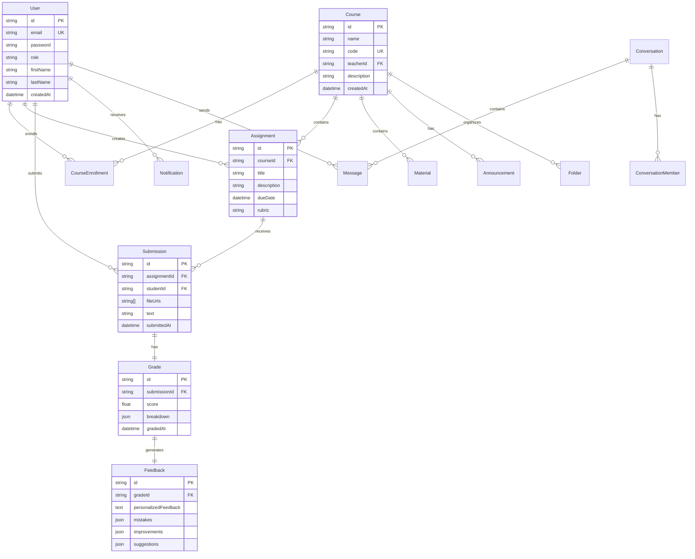

## Deployment Architecture

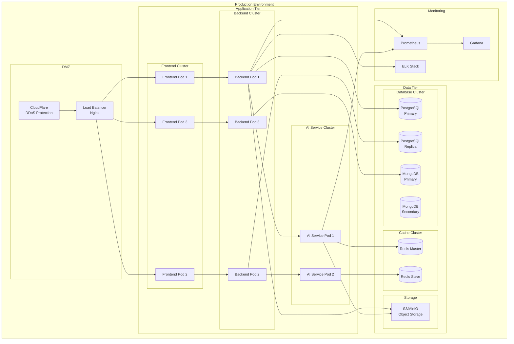

## User Journey Map

```mermaid
graph LR
    subgraph "Student Journey"
        S_Start[Visit Platform] --> S_Reg[Register/Login]
        S_Reg --> S_Browse[Browse Courses]
        S_Browse --> S_Enroll[Enroll in Course]
        S_Enroll --> S_View[View Materials]
        S_View --> S_Assign[Check Assignments]
        S_Assign --> S_Work[Complete Work]
        S_Work --> S_Submit[Submit Assignment]
        S_Submit --> S_Wait[Wait for Grading]
        S_Wait --> S_Feedback[Receive Feedback]
        S_Feedback --> S_Improve[Study Feedback]
        S_Improve --> S_Progress[Track Progress]
    end
    
    subgraph "Teacher Journey"
        T_Start[Visit Platform] --> T_Login[Login]
        T_Login --> T_Create[Create Course]
        T_Create --> T_Invite[Invite Students]
        T_Invite --> T_Upload[Upload Materials]
        T_Upload --> T_Assign[Create Assignments]
        T_Assign --> T_Monitor[Monitor Submissions]
        T_Monitor --> T_Review[Review AI Grading]
        T_Review --> T_Insights[View Class Insights]
        T_Insights --> T_Intervene[Provide Support]
    end
    
    subgraph "AI Processing"
        AI_Receive[Receive Submission] --> AI_OCR[Extract Text]
        AI_OCR --> AI_Analyze[Analyze Content]
        AI_Analyze --> AI_Grade[Apply Rubric]
        AI_Grade --> AI_Feedback[Generate Feedback]
        AI_Feedback --> AI_Personalize[Personalize Response]
        AI_Personalize --> AI_Deliver[Deliver Results]
    end
    
    S_Submit -.-> AI_Receive
    AI_Deliver -.-> S_Feedback
    T_Monitor -.-> AI_Deliver
```

## State Diagram - Assignment Lifecycle

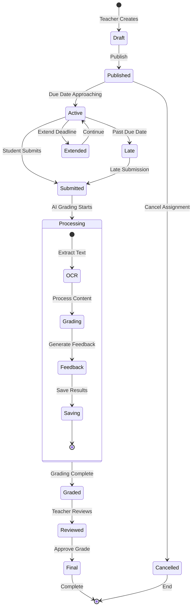

## Security Architecture

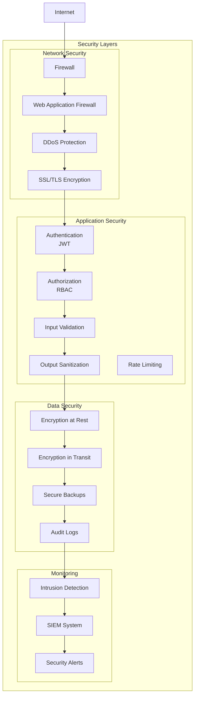

---

## Summary

This comprehensive documentation provides:

1. **Complete Requirements**: Functional and non-functional requirements clearly defined
2. **Multi-level Architecture**: From simple to detailed views
3. **Component Breakdown**: Clear separation of concerns
4. **API Documentation**: Complete endpoint reference
5. **Data Flow**: How information moves through the system
6. **AI Architecture**: Detailed AI processing pipeline
7. **Security Considerations**: Multiple security layers
8. **User Journeys**: Clear paths for all user types
9. **Deployment Strategy**: Production-ready architecture

The system is designed to be:
- **Scalable**: Horizontal scaling at every layer
- **Maintainable**: Clear separation of concerns
- **Secure**: Multiple security layers
- **Performant**: Caching and optimization throughout
- **User-friendly**: Intuitive flows for all user types